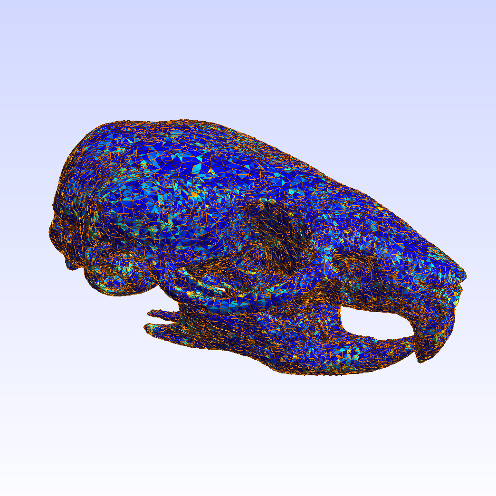
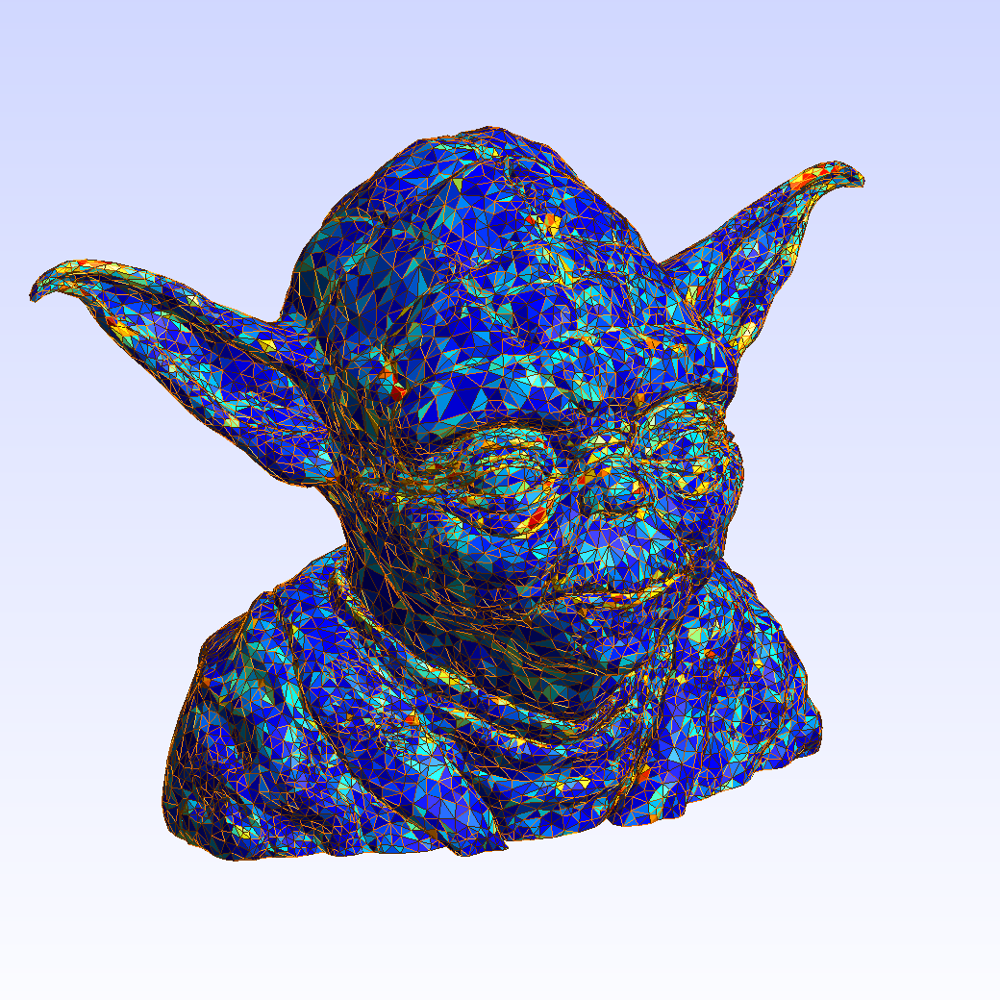
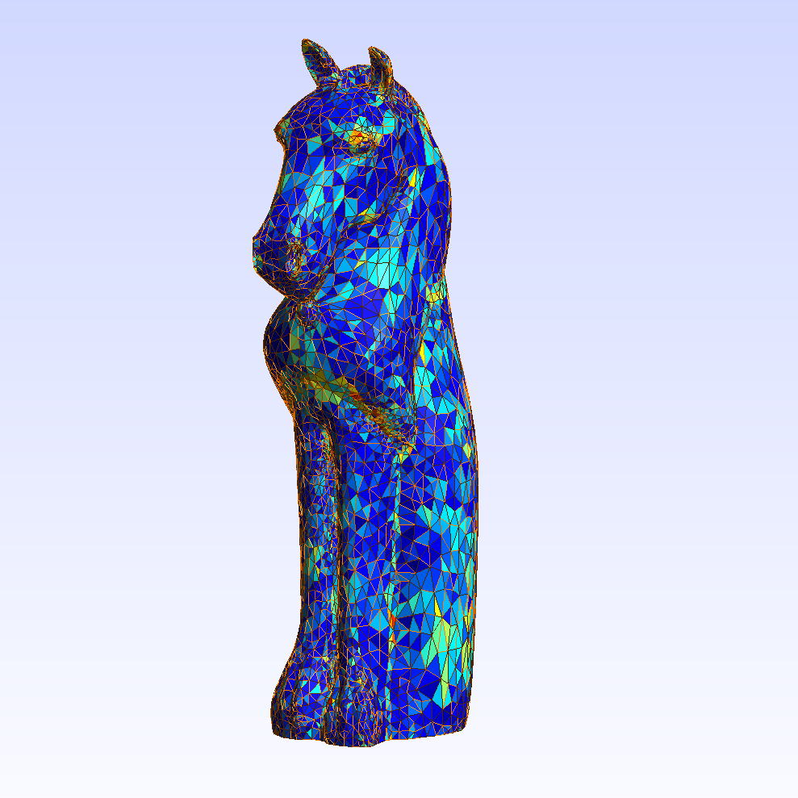
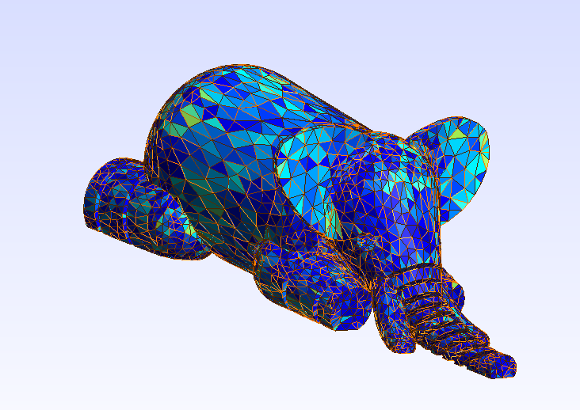
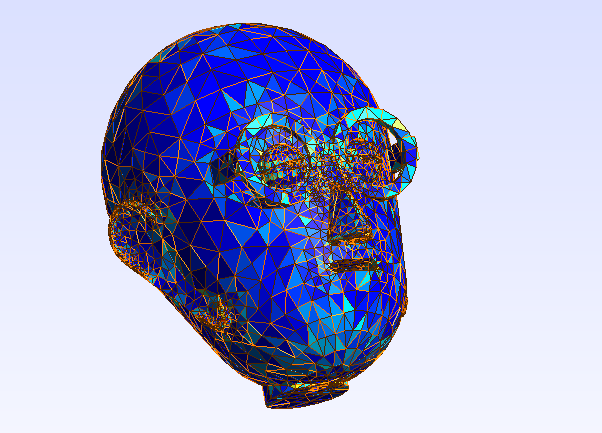
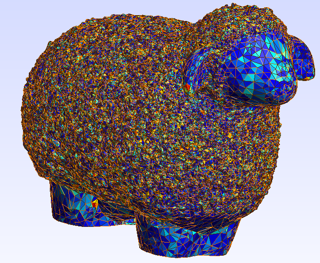

## Summary
We added parallelism to the triangle insertion section of the fast Tetrahedral Meshing Algorithm, using
shared-memory parallelism on high-core CPU machines.

This project is based on the fTetWild algorithms and code presented in <a href="https://cs.nyu.edu/~yixinhu/ftetwild.pdf">this paper</a>. 

Project Website: <https://auy86.github.io/fTetWild/>  
Project Repo: <https://github.com/auy86/fTetWild/>

## Sample Output
Here are some examples of outputs from our algorithm, run with uniform partitioning on 16 processors.

## Results
See our <a href="ParallelFinalReport.pdf" target="_blank">Final Report</a> and <a href="https://youtu.be/4iJxYMom9to" target="_blank">Final Presentation</a>.
